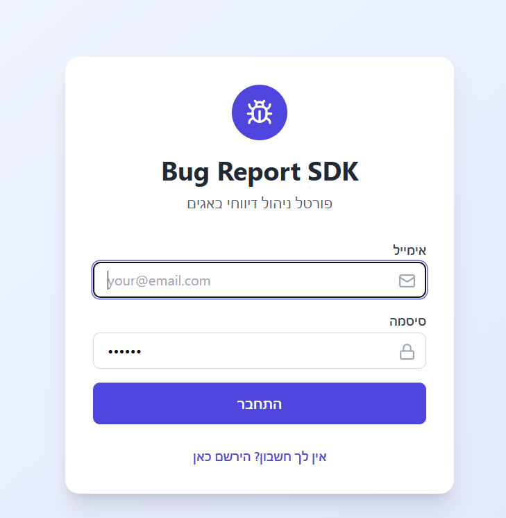
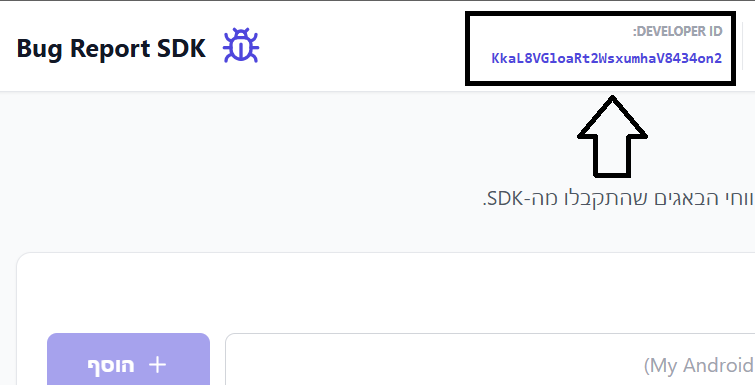
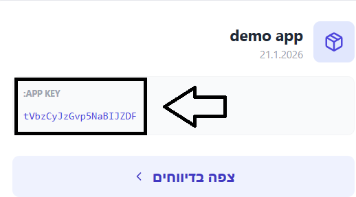

# Shake-Bug-SDK V1.0.0

**Shake-Bug-SDK** is an Android library that enables developers to integrate a quick bug reporting mechanism into their application by detecting a shake gesture on the device. The library manages system data collection, automatic screenshots, and presents a dedicated interface for users to submit reports.

## What Does the Project Do?

* **Shake Detection:** Uses the device's accelerometer sensors to detect shake gestures from the user.
* **Automatic Screenshots:** The library captures a screenshot of the application when a shake is detected to attach to the report. (not live yet, WIP)
* **Technical Data Collection:** Automatic collection of device details (model, version) and application information.
* **Bug Report UI:** Opens a screen that allows users to add a textual description of the bug.
* **Offline Sync:** Reports are stored in a local database (Room) and automatically sent when an internet connection is available using WorkManager.

## Main SDK Functions

* `ShakeBug.init(context, developerId, appId)`: Initializes the SDK, registers sensor listeners, and stores system identifiers.
* `ShakeBug.stop()`: Stops listening to motion sensors to conserve resources.

## Installation and Import

### Step 1: Add JitPack to Build File

Add the repository to your `settings.gradle.kts` file at the end of the repositories list:
```kotlin
dependencyResolutionManagement {
    repositoriesMode.set(RepositoriesMode.FAIL_ON_PROJECT_REPOS)
    repositories {
        mavenCentral()
        maven { url = uri("https://jitpack.io") }
    }
}
```

### Step 2: Add Dependency

Add the following line to your module's (app) `build.gradle.kts` file:
```kotlin
dependencies {
    implementation("com.github.Bar-Gvili:Shake-Bug-SDK:Tag")
}
```

## Configuration and Developer Portal

To activate the SDK, you need to use your unique identifiers:

1. **Registration:** Register and log in to the developer portal.
2. **DEVID:** After logging in, you'll receive your personal Developer ID.
3. **APPID:** In the portal, you can add new applications and receive a unique App ID for each one.
4. These details should be entered during the initialization of the `ShakeBug` object.

## How to Use the SDK?

Initialize the SDK within the `onCreate` function in your application's main Activity:
```kotlin
import com.rivenge.shakebug.ShakeBug

class MainActivity : AppCompatActivity() {
    override fun onCreate(savedInstanceState: Bundle?) {
        super.onCreate(savedInstanceState)
        setContentView(R.layout.activity_main)

        // Initialize the SDK with the identifiers you received from the portal
        ShakeBug.init(
            context = this,
            developerId = "YOUR_DEVID",
            appId = "YOUR_APPID"
        )
    }
}
```
# Using the portal
## Homepage
login or register to gain access to you information


## Dashboard
in the Dashboard youll first notice your dev ID indentifier for the SDK init method


after creating an app, you'll get an app ID indentifier for the SDK init method


### Stopping the SDK

If you want to temporarily stop shake detection (for example, on sensitive screens):
```kotlin
ShakeBug.stop()
```
## WIP
1. To expand and collect more vital information per report
2. To screenshot the activity, or add an option to add an image for each report. 

## System Requirements

* Android API Level 21 (Lollipop) and above
* Kotlin 1.5+
* AndroidX

## License

This project is distributed under the MIT License.

## Support

For questions and support, you can reach out through the developer portal or open an issue on GitHub.
